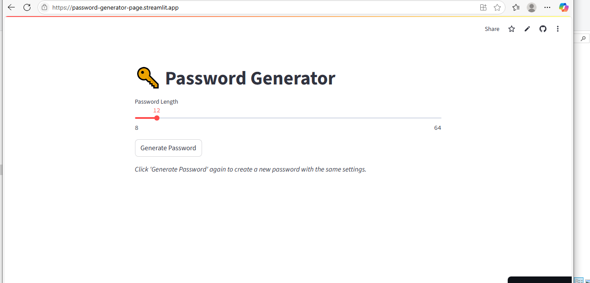
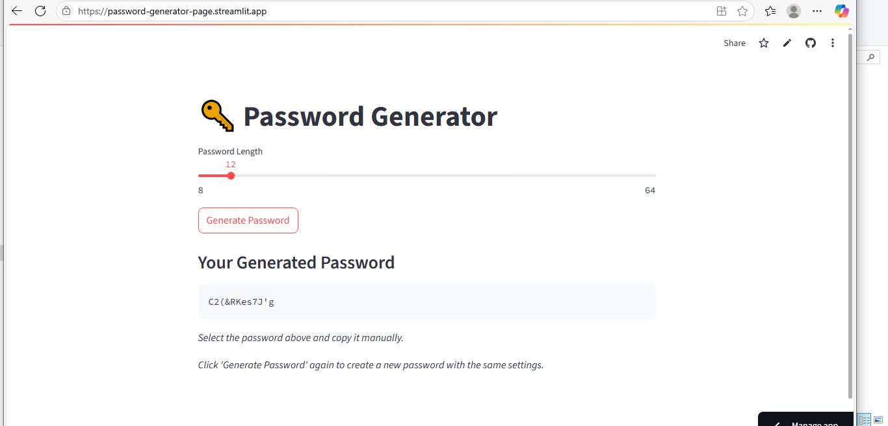

# Password Generator

A secure, random password generator built using **Python** and **Streamlit**. Instantly create strong passwords with custom settings using a responsive, interactive UI.

## Features ✨
- Generate random, secure passwords
- Customize password length
- One-click generation
- Copy password functionality
- Built entirely in Python with a clean UI

## How to Use 🎮
1. Input the amount you wish to convert.
2. Select the currencies you want to convert from and to.
3. Click the "Convert" button to see the results!

## Screenshots 📸
| Enter Amount | Convert Currency |
|------------------|----------------|
|  |  |

## Tech Stack 🛠
- *Frontend*: Streamlit
- *backend*: Python 3
- *Key Modules*: 
- streamlit 
- String
- Random

## Installation ⚙
1. Clone repository:
bash
git clone https://github.com/wizglobal-tech/PASSWORD-GENERATOR
cd PASSWORD-GENERATOR

3. Install dependencies:
bash
pip install streamlit 

4. Run the application:
bash
streamlit run password_generator.py

## Live Demo 🌐
Try the live version: [PASSWORD-GENERATOR-App](https://password-generator-page.streamlit.app/)

## Connect with Me 👋
[LinkedIn](https://www.linkedin.com/in/wisdom-douglas/) | 
[GitHub](https://github.com/wizglobal-tech)
